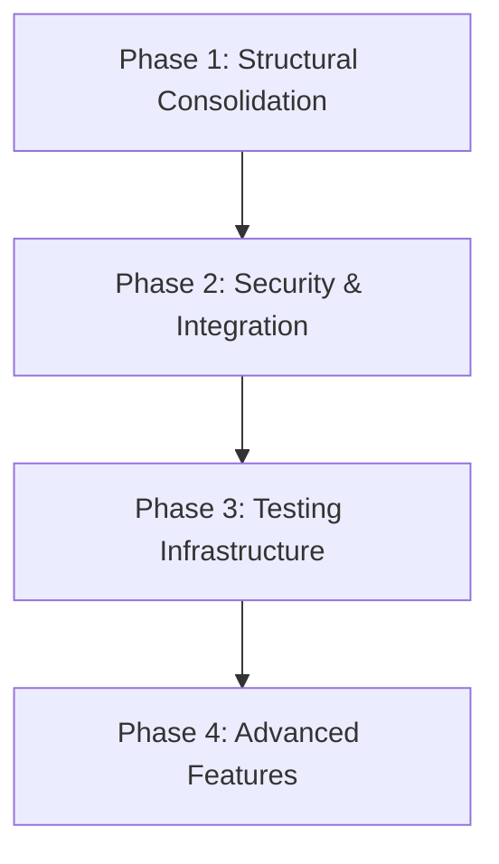

# NixOS Clan-Core Configuration Modernization Project

## Executive Summary

### Current State Assessment

The current NixOS clan-core configuration represents a functional but outdated setup that requires comprehensive modernization to meet contemporary standards for security, maintainability, and scalability. Analysis reveals several critical issues that must be addressed:

**Critical Issues Identified:**
- **Configuration Conflicts**: [`machines/luffy/default.nix`](machines/luffy/default.nix) and [`modules/configuration.nix`](modules/configuration.nix) contain duplicate and conflicting configurations
- **Outdated Dependencies**: [`flake.nix`](flake.nix) uses hardcoded commit hashes instead of proper version management
- **Security Gaps**: Missing SOPS integration, outdated secrets management, and insufficient access controls
- **Architecture Inconsistencies**: Mixed desktop environments (GNOME vs Hyprland), inconsistent user management, and fragmented module structure
- **Testing Limitations**: No CI/CD pipeline, missing validation frameworks, and inadequate documentation

**Strengths:**
- Functional clan-core integration with basic networking
- Modern kernel usage with latest packages
- Proper LUKS encryption implementation
- Clan services configuration for Tor access
- Solid foundation with clan-core framework

**Modernization Priority**: HIGH - Current configuration is functional but unsustainable for production environments

---

## Implementation Roadmap

### Phase 1: Structural Consolidation ⚠️ **P0-CRITICAL**

**Objective**: Establish solid foundation and resolve immediate conflicts

#### Core Configuration Standardization
- [ ] **Resolve Configuration Conflicts** (P0)
  - Merge [`machines/luffy/default.nix`](machines/luffy/default.nix) and [`modules/configuration.nix`](modules/configuration.nix) into unified structure
  - Standardize hostname configuration (currently "luffy" vs "nixos")
  - Unify desktop environment selection (GNOME vs Hyprland conflict)
  - Consolidate user account definitions and permissions
  
- [ ] **Module Architecture Refactoring** (P0)
  - Create standardized module structure under [`modules/`](modules/) directory
  - Implement role-based configuration modules (desktop, server, development)
  - Establish consistent import patterns and dependency management
  - Document module interfaces and configuration options

- [ ] **Flake Modernization** (P0)
  - Replace hardcoded commit hashes in [`flake.nix`](flake.nix) with proper version management
  - Implement input following patterns for dependency updates
  - Add proper input documentation and version constraints
  - Standardize system support across all configurations

#### System Configuration Cleanup
- [ ] **Desktop Environment Standardization** (P1)
  - Choose primary desktop environment (recommend Hyprland for performance)
  - Remove conflicting GNOME configuration from [`modules/configuration.nix`](modules/configuration.nix)
  - Create desktop environment selection mechanism via modules
  - Ensure consistent theming and autologin configuration

- [ ] **User Management Consolidation** (P1)
  - Standardize user account definitions across all machines
  - Implement consistent group memberships and permissions
  - Centralize SSH key management and authentication
  - Create user role-based configuration system

#### Testing & Validation
- [ ] **Basic Configuration Testing** (P1)
  - Verify configuration syntax and basic functionality
  - Test machine builds and deployments
  - Validate clan-core integration
  - Ensure rollback capabilities are preserved

**Phase 1 Dependencies**: None (foundation phase)
**Phase 1 Duration**: 1-2 weeks
**Phase 1 Success Metrics**: 
- Zero configuration conflicts
- Consistent module architecture
- All machines build successfully
- Basic clan-core functionality verified

---

### Phase 2: Security & Integration 🔒 **P1-HIGH**

**Objective**: Implement modern security practices and integration patterns

#### SOPS Secrets Management Integration
- [ ] **SOPS Infrastructure Setup** (P0)
  - Integrate SOPS-NIX from [`nix-setup-main`](nix-setup-main/) reference implementation
  - Configure age encryption keys for secrets management
  - Migrate existing secrets to SOPS-encrypted format
  - Implement secrets rotation procedures

- [ ] **Secrets Organization** (P1)
  - Create structured secrets hierarchy under [`secrets/`](nix-setup-main/secrets/) directory
  - Categorize secrets by sensitivity and access requirements
  - Implement environment-specific secret management
  - Establish secrets access auditing and logging

#### Omarchy-NIX Integration
- [ ] **Omarchy Configuration Framework** (P1)
  - Integrate omarchy-nix from [`nix-setup-main`](nix-setup-main/) reference
  - Implement configuration inheritance and override patterns
  - Create machine role definitions and configuration templates
  - Establish configuration validation and linting

- [ ] **Configuration Standardization** (P2)
  - Implement consistent configuration patterns across all machines
  - Create reusable configuration modules for common services
  - Standardize package management and system configurations
  - Document configuration standards and best practices

#### Home-Manager Integration
- [ ] **User Environment Management** (P1)
  - Integrate home-manager from [`nix-setup-main/modules/home-manager`](nix-setup-main/modules/home-manager/) 
  - Migrate user-specific configurations to home-manager modules
  - Implement user environment inheritance and customization
  - Standardize development tools and user applications

#### Security Hardening
- [ ] **Access Control Enhancement** (P1)
  - Implement role-based access control for clan services
  - Configure SSH key rotation and access auditing
  - Add fail2ban and intrusion detection systems
  - Implement security monitoring and alerting

- [ ] **Network Security** (P2)
  - Enhance firewall configuration with service-specific rules
  - Implement VPN integration (WireGuard) for secure access
  - Configure network segmentation and isolation
  - Add network monitoring and traffic analysis

**Phase 2 Dependencies**: Phase 1 completion
**Phase 2 Duration**: 2-3 weeks
**Phase 2 Success Metrics**:
- All secrets encrypted and managed via SOPS
- Home-manager integration complete
- Omarchy framework operational
- Security controls implemented and tested

---

### Phase 3: Testing Infrastructure 🧪 **P1-HIGH**

**Objective**: Establish comprehensive testing and validation framework

#### CI/CD Pipeline Implementation
- [ ] **GitHub Actions Integration** (P0)
  - Create automated build and test pipeline
  - Implement configuration validation and linting
  - Add automated dependency updates and testing
  - Configure build artifact management and deployment

- [ ] **Build Automation** (P1)
  - Implement automated machine configuration builds
  - Add configuration syntax and logic validation
  - Create automated rollback mechanisms
  - Establish build optimization and caching

#### Testing Framework
- [ ] **Configuration Testing** (P0)
  - Implement configuration syntax validation
  - Add machine-specific configuration testing
  - Create integration testing for clan services
  - Establish performance and resource usage testing

- [ ] **Deployment Testing** (P1)
  - Implement automated deployment testing
  - Add rollback scenario testing
  - Create disaster recovery testing procedures
  - Establish monitoring and alerting validation

#### Quality Assurance
- [ ] **Code Quality Tools** (P1)
  - Integrate alejandra formatter for consistent code style
  - Implement nix-linter for configuration quality
  - Add security scanning and vulnerability assessment
  - Create documentation generation and validation

- [ ] **Performance Monitoring** (P2)
  - Implement configuration build performance monitoring
  - Add resource usage optimization testing
  - Create scalability testing procedures
  - Establish performance baseline metrics

**Phase 3 Dependencies**: Phase 2 completion
**Phase 3 Duration**: 2-3 weeks
**Phase 3 Success Metrics**:
- Automated CI/CD pipeline operational
- All configurations pass validation tests
- Automated deployment and rollback working
- Performance and quality metrics established

---

### Phase 4: Advanced Features 🚀 **P2-MEDIUM**

**Objective**: Implement advanced monitoring, services, and optimization

#### Monitoring & Observability
- [ ] **System Monitoring** (P1)
  - Implement comprehensive system monitoring
  - Add performance metrics collection and alerting
  - Create dashboard for system health and status
  - Establish log aggregation and analysis

- [ ] **Configuration Monitoring** (P2)
  - Implement configuration drift detection
  - Add change tracking and audit logging
  - Create configuration compliance monitoring
  - Establish automated remediation procedures

#### Enhanced Clan Services
- [ ] **Service Expansion** (P2)
  - Implement additional clan services (backup, update management)
  - Add service health monitoring and auto-recovery
  - Create service dependency management
  - Establish service performance optimization

- [ ] **Multi-Environment Support** (P2)
  - Implement development, staging, and production environments
  - Create environment-specific configuration management
  - Add environment promotion and deployment workflows
  - Establish environment isolation and security

#### Performance Optimization
- [ ] **Build Optimization** (P2)
  - Implement build caching and optimization
  - Add dependency optimization and deduplication
  - Create build artifact management
  - Establish performance monitoring and improvement

- [ ] **Runtime Optimization** (P3)
  - Optimize system startup and service initialization
  - Implement resource usage optimization
  - Add performance tuning and monitoring
  - Create automated performance optimization

**Phase 4 Dependencies**: Phase 3 completion
**Phase 4 Duration**: 3-4 weeks
**Phase 4 Success Metrics**:
- Comprehensive monitoring system operational
- Advanced clan services deployed
- Performance optimization implemented
- Multi-environment support established

---

## Dependencies Mapping

### Critical Path Dependencies

### Cross-Phase Dependencies
- **SOPS Integration** (Phase 2) requires completed module architecture (Phase 1)
- **Home-Manager** (Phase 2) depends on user management consolidation (Phase 1)
- **CI/CD Pipeline** (Phase 3) requires stable configuration from Phase 1-2
- **Monitoring** (Phase 4) needs testing infrastructure from Phase 3

### Risk Mitigation Dependencies
- Configuration backups before major changes
- Staged deployment approach for each phase
- Rollback procedures for each implementation step
- Validation checkpoints throughout implementation

---

## Testing Checkpoints & Validation Requirements

### Phase 1 Validation
- [ ] Configuration syntax validation (nix fmt, nix-linter)
- [ ] Machine build verification (nixos-rebuild)
- [ ] Clan-core service functionality
- [ ] Network connectivity and SSH access
- [ ] Desktop environment functionality

### Phase 2 Validation
- [ ] SOPS secrets encryption/decryption
- [ ] Home-manager configuration deployment
- [ ] Omarchy configuration inheritance
- [ ] Security control effectiveness
- [ ] Access control validation

### Phase 3 Validation
- [ ] CI/CD pipeline execution
- [ ] Automated testing suite functionality
- [ ] Build artifact validation
- [ ] Deployment automation testing
- [ ] Rollback procedure verification

### Phase 4 Validation
- [ ] Monitoring system accuracy
- [ ] Service health detection
- [ ] Performance optimization effectiveness
- [ ] Multi-environment isolation
- [ ] Advanced feature functionality

---

## Risk Mitigation Strategies

### High-Risk Scenarios
1. **Configuration Conflicts Leading to Unbootable Systems**
   - Mitigation: Maintain configuration backups, test in isolated environments
   - Rollback: Keep previous working configuration versions
   - Prevention: Incremental changes with validation at each step

2. **Security Implementation Breaking Existing Access**
   - Mitigation: Gradual security implementation with fallback options
   - Rollback: Maintain emergency access procedures
   - Prevention: Thorough testing of access controls before deployment

3. **CI/CD Pipeline Failures Blocking Deployments**
   - Mitigation: Manual deployment procedures as backup
   - Rollback: Pipeline configuration versioning and rollback
   - Prevention: Pipeline testing in staging environment

### Medium-Risk Scenarios
1. **Performance Degradation from New Features**
   - Mitigation: Performance monitoring and optimization
   - Rollback: Configuration tuning and feature disabling
   - Prevention: Performance testing before deployment

2. **Compatibility Issues with New Dependencies**
   - Mitigation: Dependency version pinning and testing
   - Rollback: Dependency rollback procedures
   - Prevention: Staged dependency updates with testing

---

## Success Metrics

### Technical Metrics
- **Configuration Quality**: 100% of configurations pass validation tests
- **Build Performance**: Configuration builds complete within 10 minutes
- **Security Compliance**: All secrets encrypted, access controls implemented
- **System Reliability**: 99.9% uptime for critical services
- **Code Quality**: Consistent formatting, documentation coverage >90%

### User Experience Metrics
- **Deployment Speed**: Machine deployments complete within 15 minutes
- **Configuration Management**: <5 minutes for configuration changes
- **User Environment**: Consistent home-manager setup across all users
- **Access Management**: <2 minutes for user access provisioning
- **Troubleshooting**: <10 minutes for common issue resolution

### Operational Metrics
- **Monitoring Coverage**: 100% of critical services monitored
- **Automated Testing**: >95% test pass rate in CI/CD pipeline
- **Documentation**: Complete documentation for all configurations
- **Backup Reliability**: Daily backups with 100% recovery success
- **Security Posture**: Zero unencrypted secrets, all access audited

---

## Implementation Timeline

### Total Project Duration: 8-10 weeks

**Week 1-2**: Phase 1 - Structural Consolidation
**Week 3-5**: Phase 2 - Security & Integration  
**Week 6-8**: Phase 3 - Testing Infrastructure
**Week 9-10**: Phase 4 - Advanced Features

### Resource Requirements
- **Primary Developer**: 80% allocation for configuration development
- **Security Review**: 20% allocation for security validation
- **Testing Resources**: CI/CD infrastructure and testing environments
- **Documentation**: 10% allocation for documentation maintenance

### Budget Considerations
- **Infrastructure**: CI/CD pipeline hosting and testing environments
- **Tools**: Security tools, monitoring solutions, development tools
- **Time Investment**: Estimated 320-400 developer hours total

---

## Conclusion

This comprehensive modernization plan transforms the current functional but outdated NixOS clan-core configuration into a modern, secure, and maintainable infrastructure. The phased approach ensures minimal disruption while systematically addressing all identified issues.

Key success factors include:
- Strict adherence to the phased implementation approach
- Comprehensive testing at each phase boundary
- Maintaining rollback capabilities throughout
- Continuous validation against success metrics

The modernized configuration will provide a solid foundation for future growth, enhanced security, and improved operational efficiency while maintaining the flexibility and power of the NixOS ecosystem.